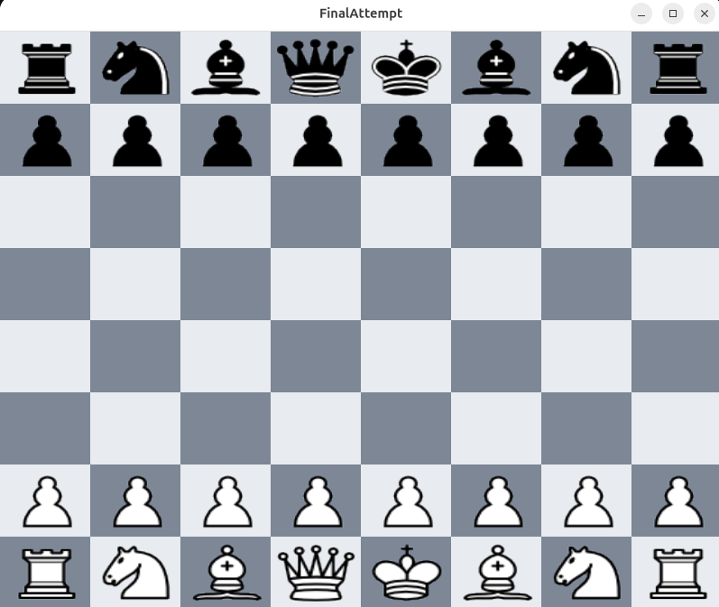

# ChessAI 

## Описание проекта 
Это шахматная игра с графическим интерфейсом, позволяющая играть против искусственного интеллекта (AI) с визуализацией шахамтной доски. После каждого вашего хода AI думает и делает ответный ход.

## Запуск 
### Windows
```bash 
make run-release
```
### Linux 
```bash
git clone https://github.com/w1zZzyy/Attempt101 
cd Attempt101
make install-linux-deps 
make run-release
```
- скачанные зависимости можно удалить так: 
```bash 
make rm-linux-deps 
```


## Функциональность 
- в desktop/assets/configs/static_config.json можно менять настройки игры: выбрать цвет (game/player_side) (white / black) или поменять начальную позицию (game/start_position) (в формате fen). Настройки расширения лучше не трогать (window height, width; square_size; left_bottom_square).
- подсветка ходов фигуры при нажатии на нее
- возможность перетаскивать фигуру




использовал компилятор GCC